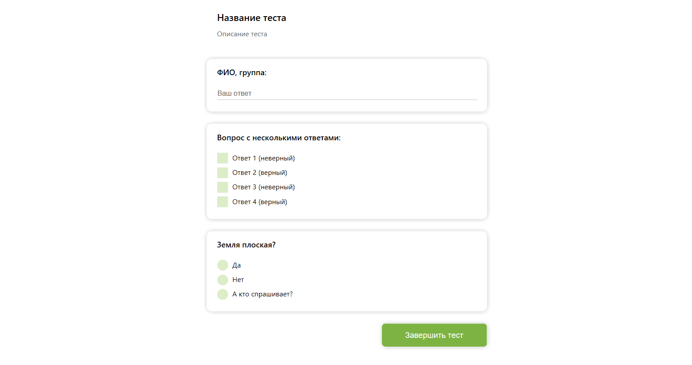

# Simple-Testing-App
При запуске происходит поиск файла input.txt, если он найден, то происходит его шифрование и сохранение в файл data.bin

Данные о вопросах загружаются из data.bin

## Форматирование
Символ | Значение
------------ | -------------
=     | Заголовок, тема теста
==    | Описание
@     | Почтовый ящик, на который отправляются результаты теста
@@    | Почтовый ящик, с которого происходит отправка
\#    | Пароль от почтового ящика, с которого происходит отправка
?     | Вопрос с одним ответом, следующая цифра - количество баллов
??    | Вопрос с несколькими ответами, следующая цифра - количество баллов
\+    | Правильный ответ, в каждом вопросе обязательно должен быть хотя бы один
\-    | Неправильный ответ

## Пример

